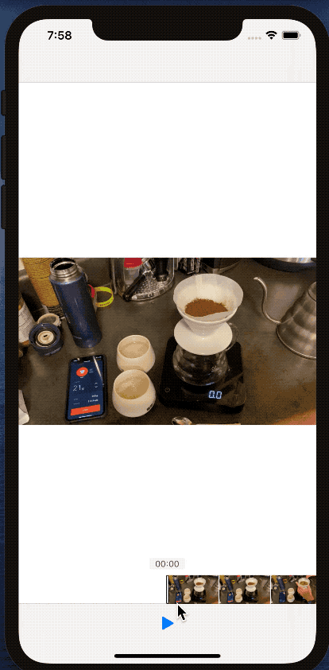

# VideoScrubber

The video scrubber allows you to seek through a video that is loaded locally.

Features:
* Plays videos
* Generates frames for video scrub bar asynchronously
* Shows timestamp during playback
* Smooth video scrubbing

Extras
* Playhead bounces on scroll past the video start/end
* Supports dark mode

Known Issues:
* Scrubbing to end and playing does not restart video on first play (playing to end does)
* Does not support landscape (contentOffset or safeArea issue)
* Loading a large video will result in a large amount of frames being generated with the 5 second per frame requirement – ideally this should be capped similar to how Apple limits frames
